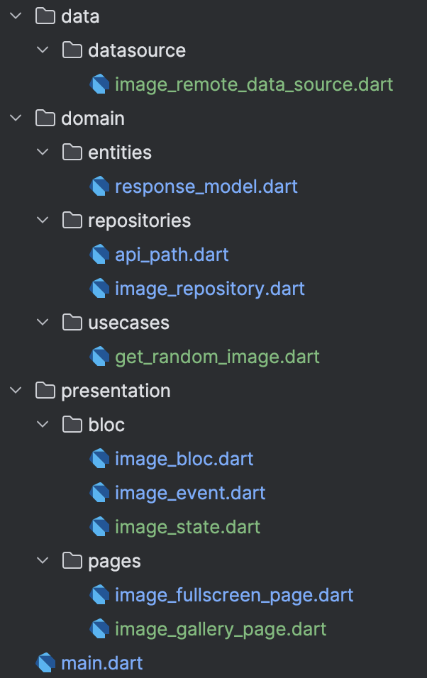

# DogGalleryApp
A Flutter-based project with the BLoC pattern and Repository pattern

**“Beginner's Guide to BLoC + Repository Pattern”**

https://github.com/user-attachments/assets/e96d4354-7359-4c26-b05d-17b1980386d2

**Project structure overview:**

.

**Explanation of each component:**
* _Bloc (Business Logic Component)_: Handles app logic & state transitions in response to user actions (e.g., button press to fetch dog image).
* _Repository_: Acts as a middle layer between the domain logic and the data layer. It hides the data source implementation (API, local DB, etc.) from the business logic.
* _Service_: Handles real API calls (networking). In Clean Architecture, this is called a Remote Data Source.
* _Model_: Represents structured data passed through your app. In Clean Architecture, the term "Entity" is used in the Domain Layer (logic-focused), while "Model" is often used for raw API parsing in the Data Layer.

**Lifecycle and state flow of BLoC:**

[User Action]

↓

[ImageBloc.add(GetRandomImage)]

↓

[on<GetRandomImage> → Calls UseCase]

↓

[UseCase calls Repository → API request]

↓

[Repository returns ResponseModel]

↓

[ImageBloc emits ImageLoaded]

↓

[UI receives new state and rebuilds]
